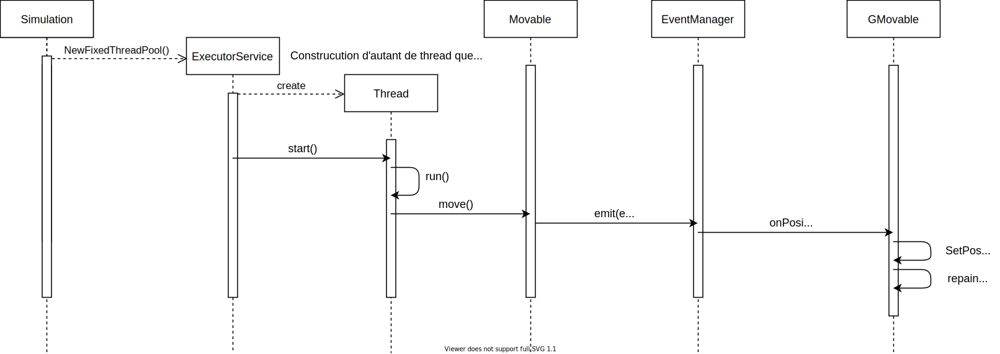

======================
Satellites et Balises
======================

:authors: - Penaud Loïc 
          - Metz Maxime
:lang: fr

Le paquetage ``edu.ubo`` contient le code source du projet il est découpé en 2 grandes parties :

- ``edu.ubo.graphicLayer`` : Bibliothèque graphique qu’on ne détaillera pas ici.
- ``edu.ubo.satelllitebeacons.main`` : Code de source de la simulation.

.. contents::
  :depth: 3
  :backlinks: top

----------------------
Gestion d’évènements
----------------------
La partie création et logique des évènements se trouve dans le paquetage ``edu.ubo.satelllitebeacons.main.event``.

Évènements
============
Touts les évènements héritent de la classe ``java.util.EventObject``.

- ``DestinationReachEvent`` est émis lorsque qu’un movement atteint sa destination.
- ``FullCapacityEvent`` est émis lorsque la mémoire de la balise arrive à saturation.
- ``MessageEvent`` est émis lorsqu’un message est envoyé par un port de communication.
- ``PositionChangedEvent`` est émis par un élément mobile (satellite ou balise) lorsque celui-ci change de position.
- ``StartSyncEvent`` est émis par un élément mobile (satellite ou balise) lorsque celui-ci commence une synchronisation avec un autre élément mobile.
- ``StopSyncEvent`` est émis par un élément mobile (satellite ou balise) lorsque celui-ci vient de finir une synchronisation avec un autre élément mobile.

Gestionnaire d’évènement
===========================
Pour faciliter l’émission d’évènement, ainsi que l’ajout et la suppression des écouteurs il existe la classe ``EventManager``.

.. caution::

  Le manager référence les écouteurs en référence forte.
  Donc tout objet référencé par un écouteur ne sera pas supprimé même après le passage du ramasse-miettes.

Port de communication
========================
La classe ``chanel.Port`` permet d’envoyer un message du type ``<T>`` à destination des écouteurs.
Celle-ci est inspirée par `l’API de canal de messagerie en JavaScript`_.

.. _`l’API de canal de messagerie en JavaScript`: https://developer.mozilla.org/en-US/docs/Web/API/Channel_Messaging_API

------------------
Élements mobiles
------------------
Les éléments mobiles se trouvent dans le paquetage ``movable``.
Toutes les classes qui réprésentent un élément mobile héritent de la classe abstraite ``Movable``.

Balise
========
La classe ``Beacon`` a pour but de simuler le comportement d’une balise.

Une balise est équipée de différents capteurs qui enregistrent des informations sur sa mémoire.
Lorsque sa mémoire est pleine la balise doit retourner au niveau de la mer pour transférer son contenu à un satellite.

Une balise est mis au courant des déplacements des satellites lorsque celle-ci écoute le port de communication ``Port<Satellite>``.
En effet un satellite doit être suffisament proche en axe `y` de la balise pour pouvoir assurer un transfert de données.

Satellite
===========
La classe ``Satellite`` a pour but de simuler le comportement d’un satellite.

Un satellite fait un mouvement horizontal, car il est en orbite dans l’espace.
Il communique sa position via un port de communication, afin que la balise puisse transférer ses données.

Movement
==========
Les éléments mobiles avec les déplacements respectent le patron de conception **Stratégie**.

Un élément mobile a un déplacement représenté par l’interface ``Movement``.
Les différentes implémentations de cette inferface permettent de couvrir un maxium de stratégie de déplacement.

L’interface ``DirectionalMovement`` représente un mouvement qui émet un évènement lorsque l’élément mobile atteint sa destination prévue.

----------------------------
Représentation de l’espace
----------------------------
Les éléments mobiles se déplacement dans un espace en deux dimensions sur les axes `x` et `y`.

Il existe deux classes pouvant assurer une cohérence de l’espace :

- La classe ``Position`` qui représente une position sur les axes `x` et `y`.
- La classe ``Vector`` qui représente un déplacement sur les axes `x` et `y`

---------------------------------
Point d’entrée de la simulation
---------------------------------
Dans le paquetage ``simulation`` on peut trouver :

- La classe ``Simulation`` où se trouve le point d’entrée de la simulation.
- Le paquetage ``components`` où se trouve les composants graphiques qui écoutent les évènements émis par les éléments mobiles.
- Le paquetage ``utils`` où se trouve les différentes constantes de la simulation et des fonctions outils.

Parallèlisme
==============
La simulation exécute les différentes méthodes associées aux éléments mobiles de façon parallèles grâce au groupe de fils créer par l’objet ``ExecutorService``.
Cette objet créer un nombre de fils égales au nombre de processeurs disponible sur l’ordinateur.
Ci-dessous un diagramme de séquence UML de la simulation :

Constantes
============
Il y a deux classes qui définissent les différentes constantes de la simulation :

- ``GConstants`` qui contient les constantes en rapport avec la partie graphique de la simulation :
  - ``BEACON_PICTURE`` : Chemin vers l’image représentant une balise.
  - ``SATELLITE_PICTURE`` : Chemin vers l’image représentant un satellite.
- ``Constants`` qui contient les constantes en rapport avec la logique de la simulation.
  - ``SEA_LEVEL`` : Nombre entier qui représente le niveau de la mer sur l’axe `y`.
  - ``MIN_RADIUS`` : Nombre entier représentant l’écart minimum de détection du satellite par la balise sur l’axe des `y` afin qu’ils puissent communiquer.
  - ``MAX_RADIUS`` : Nombre entier représentant l’écart maximum de détection du satellite par la balise sur l’axe des `y` afin qu’ils puissent communiquer.
  - ``BEACON_SPEED`` : Vitesse d’une balise.
  - ``SATELLITE_MIN_SPEED`` : Vitesse minimum du satellite.
  - ``SATELLITE_SPEED_FACTOR`` : Facteur de la vitesse du satellite. Le calcul_ se trouve dans la méthode ``Utils#getSatelliteSpeed``.
  
.. _calcul: https://lpenaud.github.io/satellites-beacons-master-degree/edu/ubo/satellitebeacons/main/simulation/utils/package-summary.html

------------
Conclusion
------------
En conclusion, ce projet nous a permis d’apprendre la gestion des évènements en Java, ainsi que son implémentation applicable dans d’autres langages.
De plus, ce projet nous a servis d’introduction à l’interface ``ExecutorService`` permettant d’exécuter des méthodes dans un contexte asynchrone et le tout en parallèle.
Si nous devions continuer le développment nous aurions corrigé un bogue qui immobilise certains éléments mobiles à partir d’un certains temps et de mieux cadrer l’utilisation l’interface ``Movement``.
